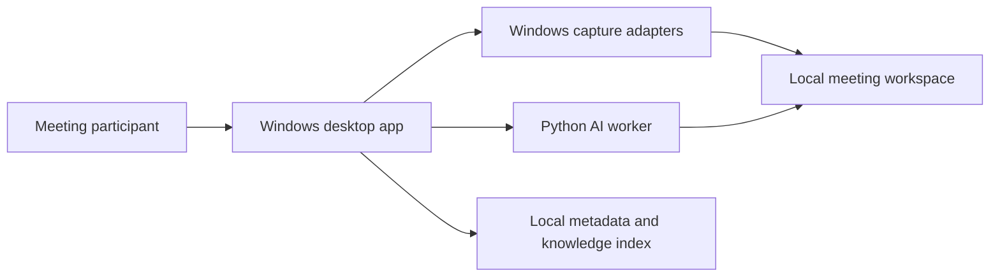

# Architecture

## Sprint 3.4.3 versioned transcript runs

Transcription model choice is job-scoped and resolves only installed catalog entries (plus an explicit custom override). Successful output is immutable and versioned by timestamp/model ID; its schema records the selected model and end-to-end processing duration alongside actual device/compute metadata. An atomic `transcript.json` copy remains the compatibility pointer. Meeting Library run discovery includes canonical-only legacy data and deduplicates pointer copies of versioned runs.

## Sprint 3.4.2 managed model lifecycle

Speech-model installation/removal runs in a short-lived Python process separate from both WPF and the long-lived AI worker. Model IDs, upstream repositories and local directory names are allow-listed in the script. Installation downloads to a unique hidden sibling, reports repository byte totals and live aggregate throughput, validates CTranslate2 artifacts and atomically renames it; cancellation is process-tree termination followed by narrowly scoped partial-directory cleanup. Removal rejects links, paths outside the managed root and the active desktop default. The long-lived worker does not cache a speech model: each isolated transcription child receives its explicit path, so the desktop can hot-apply saved model and compute settings between jobs. Capture-library relocation remains restart-bound because capture and library services own that root for their lifetime.

## Sprint 3.4.1 local speech-model catalog

Settings persist a stable curated model ID rather than a catalog-specific absolute path. At application composition time, `LocalModelResolver` maps that ID to an existing folder under `worker/models`; the worker still receives only an explicit local path and never downloads implicitly. The advanced custom-directory and environment overrides remain escape hatches. Catalog entries expose indicative quality, size and hardware guidance, while installation state is derived from the filesystem.

## Sprint 3.3.1 meeting speaker names

Manual speaker names are presentation metadata, not AI evidence. `processing/speaker-names.json` maps stable technical IDs to meeting-local display names and is written atomically. The transcript viewer and Markdown exporter resolve this sidecar at read time; `transcript.json` is never rewritten. Unknown and ambiguous assignments cannot receive a global name because a shared uncertainty label may cover multiple people.

## Sprint 3.2 speaker reconciliation

The isolated transcription process now owns a complete transcript pipeline: normalize both tracks, transcribe them independently, diarize only normalized system audio, then reconcile speaker turns by timestamp overlap. Microphone segments are deterministically `You`. A system segment receives an anonymous pyannote speaker only when one candidate has sufficient coverage and separation from the runner-up; all other outcomes remain explicitly ambiguous or unassigned. Transcript schema 3 stores these diagnostics, while schema 1 and 2 remain readable.

## Sprint 3.1 diarization runtime

The gated pyannote `community-1` pipeline is installed explicitly through Settings and loaded from disk by an isolated system-audio-only job. Hugging Face credentials are process-scoped and never persisted. Because TorchCodec DLL compatibility is unreliable in the pinned Windows CPU runtime, the adapter validates and loads our PCM16 WAV directly into a waveform/sample-rate tensor before inference. Exclusive speaker diarization is the canonical output for later transcript reconciliation.

## Sprint 2.9 settings boundary

Desktop settings are local, schema-versioned and atomically replaced. The main composition root reads them once and injects storage/model/compute decisions into capture and transcription orchestration. This prevents different features from silently using different library roots.

## Sprint 2.8 operational status

Core owns a thread-safe bounded `OperationalStatusLog`; WPF projects its immutable snapshots into the dashboard. Status producers remain the existing orchestration paths rather than a second event bus. Runtime initialization publishes a distinct loading/final state, while capture and transcription continue to own their domain-specific messages.

## Sprint 2.7 library boundary

`MeetingLibrary` is a read-only Core projection over the session workspace format. It tolerates individual missing or corrupt manifests and returns both visible entries and discovery issues. WPF owns selection and commands, while the existing worker client remains the sole transcription executor. Audio-only capture is represented by absence of a screen stream, never by a placeholder video.

## Product boundary

AI Meeting Assistant is a local-first Windows desktop product. It owns capture, processing orchestration, meeting artifacts and their lifecycle. The previous Marvin toolchain and codebase are explicitly outside this repository.

## System context



## Runtime responsibilities

The .NET desktop process owns WPF UI and lifecycle, screen/audio capture, consent and source selection, job orchestration, the meeting library, settings, and worker supervision.

The Python process owns media preprocessing, WhisperX transcription/alignment, pyannote diarization, and later AI enrichment. It has no UI access and does not own application state.

The application may package a compatible worker runtime in a later distribution slice, but it does not bundle speech, diarization or language-model weights by default. A local Model Manager owns explicit downloads/imports, compatibility metadata, integrity verification, storage and removal. Model selection is a persisted default with optional per-job override; model files remain outside application binaries and session workspaces.

Capture masters favor recoverability and downstream processing: independent PCM WAV tracks and H.264 MP4. User-selected compressed formats are derived exports after finalization. Screen recording is independently switchable; full-motion capture remains the meeting default, while a future presentation/snapshot mode may reduce storage using content-aware slide changes rather than arbitrary long frame intervals.

The processes initially exchange newline-delimited JSON over redirected standard input/output. Every message carries a protocol version and request ID. Large media and result artifacts travel through scoped filesystem paths. This is inspectable today and permits a later move to named pipes or gRPC.

Sprint 2.1 packages `worker/main.py` into the desktop output and supervises it as one hidden, long-lived child process with redirected standard streams. Requests are serialized through a lifecycle lock, correlated by request ID, constrained by a bounded timeout and checked against protocol 1.0. Stdout is protocol-only; the last ten stderr lines are retained for actionable exit diagnostics. Sprint 2.2 raises the default request budget to 30 seconds because the first native Torch/CUDA discovery after installation or antivirus scanning can legitimately exceed the original ten-second transport-only budget.

Sprint 2.2 adds an isolated repository-local `worker/.venv`, a reproducible bootstrap pinned to stable WhisperX 3.8.6 and structured health diagnostics for Python, WhisperX, Torch, pyannote, FFmpeg and CUDA/CPU mode. Python 3.10 through 3.13 are accepted by the current stack. The desktop prefers an explicit `AI_MEETING_ASSISTANT_PYTHON` override, then discovers the local virtual environment and finally falls back to `python` on `PATH`. Health checks never load or download model weights; those remain an explicit Model Manager concern.

Sprint 2.3 runs each transcription in an isolated child process supervised by the long-lived worker. The UI-side client starts a job, polls bounded status and can cancel it; cancellation terminates native inference without killing the worker. FFmpeg normalizes finalized WAV tracks independently to mono PCM16/16 kHz. Microphone and system audio are transcribed separately, then timestamp-merged with explicit source labels; waveform mixing is avoided because overlapping speech can suppress one side during single-stream ASR. WhisperX accepts only an existing local model directory and atomically writes `processing/transcript.json`; no job call may trigger an implicit model download. Transcript alignment, speaker diarization and automatic post-recording orchestration remain later slices.

Sprint 2.4 adds deterministic hardware profiles. `automatic` selects CUDA/float16 only when Torch confirms a compatible NVIDIA device and otherwise records an explicit CPU/int8 fallback reason. `prefer-cuda` fails when unavailable; `cpu-only` overrides a GPU. CUDA batch size scales conservatively with total VRAM, while CPU remains batch 2. Health and transcript metadata expose the actual Torch build, CUDA build, device, VRAM, compute type and batch size. The current Intel-only reference machine therefore remains on the validated CPU path without installing unused CUDA packages.

Sprint 3.5.1 evaluates Intel acceleration without changing that production path. Ignored `worker/.openvino-spike/` packages and separate OpenVINO Whisper weights feed a benchmark-only harness. OpenVINO reports CPU, Intel integrated GPU and Intel NPU on the reference Core Ultra laptop. Audio is processed in overlapping 30-second windows rather than the Transformers monolithic long-form wrapper; midpoint ownership and clamped boundaries avoid timestamp overlap. Per-chunk progress is visible and the JSON report is atomically updated after every completed device, including an explicit interrupted state. Reports persist compile and inference timing, real-time factor, timestamps, text and disk footprint; quality and end-to-end speed on representative meetings gate any production backend.

The representative 39:54 Optimum/Transformers GPU run completed but rejected that adapter for production: repeated-phrase hallucinations and 129 adjacent exact duplicate segments inflated output to more than three times the validated WhisperX system-audio text. A second adapter uses Intel's native OpenVINO GenAI `WhisperPipeline` and the existing local WhisperX/Pyannote VAD before GPU inference. On the same recording, VAD took 207.106 seconds and Intel-iGPU inference 103.773 seconds; output fell to 15,931 characters and three adjacent exact duplicates versus the validated WhisperX system-audio transcript's 16,503 characters.

Sprint 3.5.2 integrates only that accepted native adapter as the explicit `intel-gpu` compute preference. The desktop resolves a separately managed OpenVINO Whisper Small FP16 directory and isolated runtime; Settings rejects incompatible models, custom directories or missing assets instead of falling back. The disposable transcription process loads one GPU pipeline, runs CPU VAD and GPU inference independently for microphone and system audio, reports each phase through the existing job status protocol, reconciles segment boundaries and then reuses the established source merge and speaker-diarization stages. Process isolation preserves cancellation and bounded desktop shutdown. Experimental weights and runtime remain local ignored assets, while only the integration code is shipped.

Sprint 3.8.1 amortizes that isolated model startup without retaining native inference in the protocol worker. A bounded 750 ms window pairs contemporaneous microphone and system-audio chunks from the same session and options. One disposable job normalizes both independent WAV inputs, loads the model once and emits one source-labelled batch document. Core then atomically splits it back into the established per-source chunk artifacts, retaining each detected language and segment source. Final catch-up enqueues all missing chunks before waiting so it benefits from the same pairing. Unpaired handover/tail chunks continue through the original single-input path.

Sprint 3.8.2 restricts final full-meeting diarization to conservative system-speech windows derived from the already reconciled ASR evidence. Each window receives 750 ms of context, gaps up to one second merge and compressed turns are restored to the original meeting timeline. Untranscribed silence no longer reaches Pyannote, while source timestamps and the final assignment algorithm remain unchanged. The final transcript separately records wall-clock finalization duration, analyzed/original seconds and window count so cumulative live-processing work is not mistaken for post-meeting latency.

The preserved 46:34 production meeting validates the trade-off on identical evidence. Thirty-one windows covered 1,712.212 of 2,791.374 seconds and completed in 387.6 seconds versus the approximately 574-second full-track baseline. Text and timeline were byte-equivalent at the document boundary, speaker count remained seven, and three net assignments out of 409 system segments became uncertain. The five changed items were short boundary phrases; one baseline ambiguity improved. This measured 32.5% latency reduction with a 0.73% assignment delta is accepted for Sprint 3.8.2 and remains visible as the next tuning baseline.

Sprint 3.8.3 evaluates XPU segmentation step 0.20 through a request-scoped, range-validated benchmark override. Against the same 31 windows it completed in 373.0 seconds, retained all 628 text/timeline segments, increased assigned system segments from 389 to 390 and removed both ambiguous assignments. It also merged three small fragments totaling 40.3 seconds and reduced seven technical speaker IDs to five. Because participant count cannot prove voice identity, that merge is a greater product risk than conservative oversegmentation: users can give two split IDs the same display name, while a false merge cannot be separated after the fact. The 15-second improvement is rejected and step 0.15 remains the default. Overrides remain XPU-only and validate whitelisted batch/step bounds.

Sprint 3.8.4/3.8.5 make finalization explicitly two-phase. After catch-up and timeline reconciliation, Core writes `processing/preliminary/transcript.json` and atomically copies it to the canonical `processing/transcript.json`; UI status events carry that path so viewing and library discovery no longer wait for Pyannote. Speaker enrichment runs against retained merged evidence and atomically replaces the canonical pointer on success. Only then does a path-constrained best-effort cleanup remove `live-chunks`, paired batch scratch, temporary normalized WAVs and the preliminary directory. It preserves capture masters, final/versioned transcripts, `incremental-transcript-merged.json` and per-source `chunk_*.json` transcript evidence. Failure or cancellation occurs before cleanup and therefore retains every recovery input.

Sprint 2.5 connects this pipeline to the WPF shell. The capture coordinator exposes only the latest successfully finalized session. With an explicitly discovered local model, the UI enables a deliberate transcription action, polls job phases/progress, exposes the resulting artifact path and forwards cancellation to the isolated inference process. Transcription does not start automatically after recording, and failed/interrupted sessions are not selected. Development model discovery is temporary until persisted Model Manager selection exists.

Sprint 2.6 adds a Core-owned transcript document boundary for schema 1/2 validation, chronological ordering, source/timestamp formatting and atomic Markdown/JSON exports. WPF presents the validated segments in a separate transcript window with non-destructive microphone/system-audio filters. The newest local transcript is rediscovered after application restart, so viewing does not require a new recording. Export destinations use the native save dialog and remain fully local.

## Layering

```text
Desktop presentation
        ↓
Core use cases and ports
        ↓
Windows capture / persistence / worker adapters
```

Contracts are shared only by transport adapters. Dependencies point inward: Core does not reference WPF, capture APIs, Python, WhisperX or storage libraries.

## Meeting workspace

```text
artifacts/captures/session_{timestamp}/
  manifest.json
  screen_{timestamp}.mp4
  system_audio_{timestamp}.wav
  microphone_{timestamp}.wav

data/meetings/{meeting-id}/              # later durable library
  manifest.json
  capture/...
  processing/transcript.json
  processing/diarization.json
  output/minutes.md
```

Writes should use temporary files followed by atomic rename. The manifest records processing state so interrupted jobs can resume.

Sprint 1.6.1 implements the capture-session form of this workspace. `manifest.json` schema version 1 stores the session ID, lifecycle status, UTC wall-clock boundaries, monotonic duration, selected source IDs and one relative path/start offset per stream. Manifest replacement uses a sibling temporary file followed by atomic move, so readers never observe partially serialized JSON. Durable meeting IDs, recovery and migration into `data/meetings` remain later work.

Sprint 1.6.2 advances the manifest to schema version 2. After all containers are finalized, managed parsers read WAV `fmt`/`data` chunks and the MP4 `mvhd` timescale/duration. Each stream receives `MediaDurationMilliseconds`, `ExpectedEndOffsetMilliseconds` and `SessionEndDifferenceMilliseconds`. Alignment quality is the spread between the earliest and latest expected stream end: `aligned` at or below 100 ms, otherwise `warning`. Container finalization delay remains visible as the difference between stream ends and total session duration but does not count as inter-stream drift.

Sprint 1.6.3 scans capture workspaces on startup. Manifests left in `preparing` or `recording` are atomically moved to `interrupted`, assigned a completion observation time and marked alignment `unavailable`; existing media is never removed or rewritten. Missing artifacts are listed in the recovery detail, while malformed manifests are surfaced as issues and preserved for inspection. Before creating a session, the target drive must report at least 2 GiB free.

## Capture direction for Sprint 1

- Screen: Windows Graphics Capture (Sprint 1.5)
- System/Teams audio: WASAPI loopback for the selected render endpoint (Sprint 1.4)
- Microphone: WASAPI capture from the selected input endpoint (Sprint 1.3, complete)
- Synchronization: one monotonic session clock, retaining timestamps per stream (Sprint 1.6)
- Capture streams separately first; compose previews or exports later

This avoids dependence on Teams internals and supports other meeting applications. Device changes, sleep, unplugging and exclusive-mode conflicts become recoverable recording events.

### Microphone capture (Sprint 1.3)

The application captures the selected microphone via WASAPI IAudioClient in shared mode:
1. Activate IAudioCapture interface from the chosen IMMDevice
2. Negotiate a PCM wave format (typically 16-bit, 44.1kHz or 48kHz)
3. Read audio frames via event-driven circular buffer (no polling)
4. Calculate live level (RMS dB) per buffer for UI feedback
5. Write raw PCM frames to a WAV file under `artifacts/captures/{timestamp}.wav`
6. On device loss, permission denial, or exclusive-mode conflict, report error to state machine

The Windows adapter (WasapiAudioCapture) is internal to the capture layer; the Core layer knows only about IAudioCaptureProvider events (FrameCaptured, LevelChanged, Failed).

### System audio loopback (Sprint 1.4.1)

The selected Windows render endpoint uses the same PCM conversion and WAV writer as microphone capture, but initializes `IAudioClient` with both `AUDCLNT_STREAMFLAGS_LOOPBACK` and event-callback flags. Sprint 1.4.2 starts loopback first and microphone second, writes separate files with one shared timestamp and rolls both providers back if either start fails. Stop, capture fault and window shutdown converge on the same serialized cleanup path.

### Capture robustness (Sprint 1.4.3)

Runtime failure in either audio provider fails the whole `RecordingSession`; the coordinator then stops and disposes both providers exactly once. Cleanup continues for the second stream even if stopping the first throws. Repeated shutdown is idempotent. Known WASAPI HRESULTs for device invalidation, exclusive use and access denial are translated into recovery guidance. Loopback silence is materialized in the WAV timeline even when the endpoint emits no packets.

Live microphone handover is intentionally a future segmented-capture feature: keep system audio running, finalize the old microphone WAV and start a new microphone segment with its session-clock offset. This avoids mixing devices with different channel counts or sample formats inside one WAV.

### Screen capture (Sprint 1.5.1)

The selected Windows display is recorded to `artifacts/captures/screen_{timestamp}.mp4` as H.264 at 30 fps. `ScreenCaptureCoordinator` depends only on the Core `IScreenCaptureProvider` port. Its Windows implementation wraps ScreenRecorderLib 6.6.0, which uses native Microsoft Media Foundation encoding and accepts the stable display device names already returned by source discovery. Sources larger than 3840×2160 are proportionally downscaled to even encoder-safe dimensions; smaller displays retain their native size. Library-provided audio is disabled: microphone and loopback remain independent WASAPI streams and will be composed with screen capture in Sprint 1.5.2.

The application targets x64 for this native adapter while Core remains platform-independent. Start waits for a real recording-status event, stop waits for MP4 finalization, and asynchronous encoder failures enter the existing failed-session path. The provider boundary keeps the third-party encoder replaceable and enables lifecycle tests without invoking desktop capture.

Live display handover is deferred. The UI should eventually offer one seamless switch; the adapter may update the source dynamically when dimensions and encoder state permit, otherwise the session workspace may retain internal timestamped video segments.

### Combined screen and audio capture (Sprint 1.5.2)

`CombinedCaptureCoordinator` composes the screen coordinator with the existing dual-audio coordinator. One session timestamp names all three independent artifacts: `screen_*.mp4`, `system_audio_*.wav` and `microphone_*.wav`. Screen capture starts first, followed by loopback and microphone. If any later start fails, every already-started provider is stopped and disposed. Stop finalizes audio and then the MP4 while preserving the first cleanup error.

The composite forwards both live audio levels and all provider failures to the existing recording state machine. This slice establishes one atomic user-visible lifecycle, not sample-accurate synchronization; per-stream monotonic timestamps and alignment metadata remain Sprint 1.6.

### Combined capture robustness (Sprint 1.5.3)

Runtime failure of screen, loopback or microphone fails the whole recording and converges on the serialized combined cleanup path. Cleanup attempts both audio providers and the screen provider even when an earlier stop throws, so an audio finalization problem cannot prevent MP4 finalization. Rapid cycles and repeated shutdown are idempotent and covered with exactly-once lifecycle assertions. Media Foundation sink/format failures and access failures are translated into actionable display, driver and privacy guidance.

## Privacy and quality guardrails

- Show an unambiguous recording indicator and require consent confirmation.
- Process locally by default; remote providers are explicit opt-in.
- Never put tokens, model secrets or transcript content in diagnostic logs.
- Define retention, deletion and export before saving production recordings.
- Unit-test state transitions and protocol mapping; hardware-smoke-test capture adapters.
- Use a sanitized golden media fixture for transcription/diarization regression tests.
