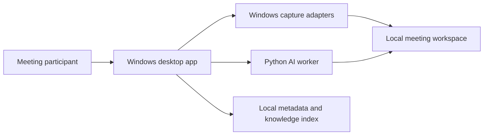

# Architecture

## Product boundary

AI Meeting Assistant is a local-first Windows desktop product. It owns capture, processing orchestration, meeting artifacts and their lifecycle. The previous Marvin toolchain and codebase are explicitly outside this repository.

## System context



## Runtime responsibilities

The .NET desktop process owns WPF UI and lifecycle, screen/audio capture, consent and source selection, job orchestration, the meeting library, settings, and worker supervision.

The Python process owns media preprocessing, WhisperX transcription/alignment, pyannote diarization, and later AI enrichment. It has no UI access and does not own application state.

The processes initially exchange newline-delimited JSON over redirected standard input/output. Every message carries a protocol version and request ID. Large media and result artifacts travel through scoped filesystem paths. This is inspectable today and permits a later move to named pipes or gRPC.

## Layering

```text
Desktop presentation
        ↓
Core use cases and ports
        ↓
Windows capture / persistence / worker adapters
```

Contracts are shared only by transport adapters. Dependencies point inward: Core does not reference WPF, capture APIs, Python, WhisperX or storage libraries.

## Meeting workspace

```text
data/meetings/{meeting-id}/
  manifest.json
  capture/screen.mp4
  capture/system-audio.wav
  capture/microphone.wav
  processing/transcript.json
  processing/diarization.json
  output/minutes.md
```

Writes should use temporary files followed by atomic rename. The manifest records processing state so interrupted jobs can resume.

## Capture direction for Sprint 1

- Screen: Windows Graphics Capture
- System/Teams audio: WASAPI loopback for the selected render endpoint
- Microphone: WASAPI capture from the selected input endpoint
- Synchronization: one monotonic session clock, retaining timestamps per stream
- Capture streams separately first; compose previews or exports later

This avoids dependence on Teams internals and supports other meeting applications. Device changes, sleep, unplugging and exclusive-mode conflicts become recoverable recording events.

## Privacy and quality guardrails

- Show an unambiguous recording indicator and require consent confirmation.
- Process locally by default; remote providers are explicit opt-in.
- Never put tokens, model secrets or transcript content in diagnostic logs.
- Define retention, deletion and export before saving production recordings.
- Unit-test state transitions and protocol mapping; hardware-smoke-test capture adapters.
- Use a sanitized golden media fixture for transcription/diarization regression tests.

